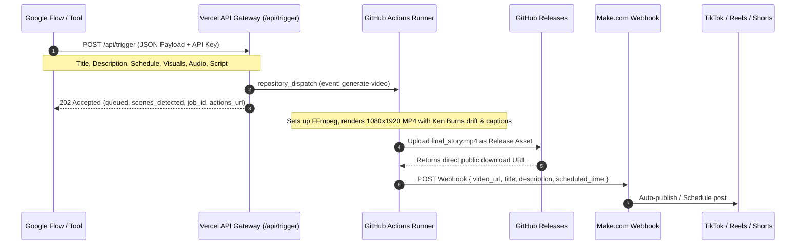

# 🚀 Automated Publishing Pipeline: Google Flow -> Vercel / GitHub Actions -> Make.com

This guide explains how to connect your automated story generator (Google Flow) to render 9:16 TikTok-style videos on GitHub Actions and automatically upload them via **Make.com**.

---

## 🏗️ Architecture Overview



---

## 1. ⚡ Calling the API from Google Flow

### Method A: Via Vercel Gateway (Recommended)
Make an authenticated HTTP POST request from Google Flow / Google Apps Script:

* **URL:** `https://your-project.vercel.app/api/trigger` (or `/api/render`)
* **Method:** `POST`
* **Headers:**
  * `Content-Type: application/json`
  * `x-api-key: YOUR_API_SECRET_KEY` (or `Authorization: Bearer YOUR_API_SECRET_KEY`)
* **Body:**
```json
{
  "title": "The Mystery of the Golden Forest",
  "description": "Elsa embarks on a journey deep into the Whispering Woods. #story #shorts #tiktok",
  "upload_date": "2026-09-18T18:00:00Z",
  "visuals_url": "https://example.com/assets/story_visuals.zip",
  "audio_url": "https://example.com/assets/narration.mp3",
  "script_text": "Scene 1: In a quiet village, Elsa begins her day before sunrise.\n(Next image)\nScene 2: The magical yeast has gone missing from the pantry.\n(Next image)\nScene 3: Elsa ventures into the Enchanted Forest to find answers.",
  "make_webhook_url": "https://hook.us1.make.com/your-make-webhook-id"
}
```

#### Detailed Confirmation Response from Vercel (`202 Accepted`):
```json
{
  "ok": true,
  "status": "queued",
  "job_id": "job_1726645800000_3x8a9",
  "title": "The Mystery of the Golden Forest",
  "scenes_detected": 3,
  "scheduled_for": "2026-09-18T18:00:00Z",
  "audio_source": "remote_url",
  "visuals_source": "remote_url",
  "make_webhook_configured": true,
  "actions_url": "https://github.com/AllensCreations/FB-2minutes-Storymaker/actions",
  "repository": "AllensCreations/FB-2minutes-Storymaker",
  "timestamp": "2026-09-18T00:15:00.000Z",
  "message": "Story video generation successfully queued in GitHub Actions. Make.com will receive the published video once rendering completes."
}
```

> **Base64 Alternative:** If your Google Flow does not host ZIP/MP3 files publicly, you can pass `"visuals_base64": "<base64_encoded_zip>"` and `"audio_base64": "<base64_encoded_mp3>"` instead!

---

### Method B: Direct to GitHub REST API (Zero Servers)
If you don't use Vercel, Google Flow can trigger GitHub Actions directly:

* **URL:** `https://api.github.com/repos/AllensCreations/FB-2minutes-Storymaker/dispatches`
* **Method:** `POST`
* **Headers:**
  * `Authorization: Bearer <YOUR_GITHUB_PAT>`
  * `Accept: application/vnd.github+json`
  * `Content-Type: application/json`
* **Body:**
```json
{
  "event_type": "generate-video",
  "client_payload": {
    "title": "The Mystery of the Golden Forest",
    "description": "Story description #shorts",
    "scheduled_time": "2026-09-18T18:00:00Z",
    "visuals_url": "https://example.com/story_visuals.zip",
    "audio_url": "https://example.com/narration.mp3",
    "script_text": "Scene 1...\n(Next image)\nScene 2...",
    "make_webhook_url": "https://hook.us1.make.com/your-make-webhook-id"
  }
}
```

---

## 2. 📦 Payload Sent to Make.com Webhook

Once GitHub Actions completes the FFmpeg rendering (usually 60-90 seconds), it automatically pings your `make_webhook_url` with the exact payload:

```json
{
  "video_url": "https://github.com/AllensCreations/FB-2minutes-Storymaker/releases/download/v-run-12345678/final_story.mp4",
  "title": "The Mystery of the Golden Forest",
  "description": "Elsa embarks on a journey deep into the Whispering Woods. #story #shorts #tiktok",
  "scheduled_time": "2026-09-18T18:00:00Z"
}
```

---

## 3. 🎯 Setting Up Make.com Scenario

1. In Make.com, create a new scenario with a **Custom Webhook** module.
2. Copy the webhook URL and pass it as `make_webhook_url` in your Google Flow request.
3. Add an **HTTP (Get a file)** module:
   * **URL:** `{{video_url}}`
4. Add your Social Publishing modules (e.g. **TikTok (Upload Video)**, **YouTube (Upload a Video)**, or **Facebook Pages (Create a Reel)**):
   * **Video File:** Data from the HTTP module
   * **Title:** `{{title}}`
   * **Description:** `{{description}}`
   * **Schedule Date/Time:** `{{scheduled_time}}`

---

## 4. 🔑 Vercel Environment Variables

When deploying the API Gateway to Vercel:
1. Go to your Vercel Project Settings -> **Environment Variables**.
2. Add:
   * `API_SECRET_KEY`: Secret string required in `x-api-key` header to secure your endpoint against spam.
   * `GH_PAT` (or `GITHUB_TOKEN`): GitHub Personal Access Token (classic with `repo` scope or fine-grained token with Actions read/write).
   * `GITHUB_REPOSITORY`: `AllensCreations/FB-2minutes-Storymaker`
