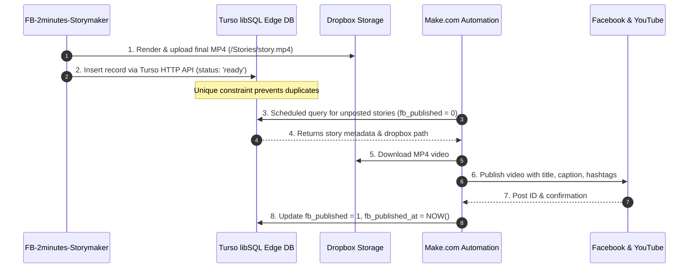

# 🗄️ Turso + Make.com Integration Guide

Complete guide on replacing **Google Apps Script (Google Sheets)** with **Turso (libSQL / Edge SQLite)** and connecting **Make.com** for social distribution and automated publishing.

---

## ⚡ Why Use Turso Instead of Google Apps Script?

| Feature | Google Apps Script (Sheets) | Turso (libSQL Database) |
| :--- | :--- | :--- |
| **Response Latency** | 2,000ms – 5,000ms (Cold starts) | **10ms – 30ms** (Instant Edge) |
| **Data Integrity** | Prone to concurrent cell overwrites | **ACID compliant**, strict SQL constraints |
| **Duplicate Prevention** | Manual string scanning across rows | **`UNIQUE(filename)`** enforced at DB level |
| **Make.com Connectivity** | Fragile Web App GET/POST redirects | **Direct HTTP API v2 Pipeline** |
| **Scalability** | Slows down past ~5,000 rows | **Millions of rows**, instant indexed queries |
| **Cost** | Free (Google quotas apply) | **Generous Free Tier** (500 DBs, 9GB storage, 1B reads/mo) |

---

## 🏗️ Architecture Overview



---

## 1. 🛠️ Setting Up Your Turso Database

### Step 1.1: Install Turso CLI or Sign Up Online
You can manage Turso from your terminal or at [turso.tech](https://turso.tech).

**Install Turso CLI (Linux/macOS):**
```bash
curl -sSfL https://get.tur.so/install.sh | bash
```

**Log in to your account:**
```bash
turso auth signup
# or
turso auth login
```

### Step 1.2: Create a New Database
Create a database named `storymaker-db`:
```bash
turso db create storymaker-db
```

### Step 1.3: Get Your Database URL and Auth Token
Run:
```bash
turso db show storymaker-db --url
# Outputs: libsql://storymaker-db-[your-org].turso.io
```
> [!NOTE]
> For the HTTP API, replace `libsql://` with `https://`.
> Example: `https://storymaker-db-[your-org].turso.io`

Create a non-expiring authentication token:
```bash
turso db tokens create storymaker-db
```
Save this token securely. You will use it in Make.com and API requests.

---

## 2. 📋 Database Schema (SQL DDL)

Open the Turso interactive shell:
```bash
turso db shell storymaker-db
```

Paste the following table schema:

```sql
CREATE TABLE IF NOT EXISTS stories (
    filename TEXT PRIMARY KEY,
    title TEXT,
    caption TEXT,
    description TEXT,
    dropbox_path TEXT,
    status TEXT DEFAULT 'ready',             -- 'pending', 'ready', 'published', 'failed'
    uploaded_to_fb_ig TEXT DEFAULT 'pending', -- 'pending', 'published', 'failed'
    uploaded_to_youtube TEXT DEFAULT 'pending', -- 'pending', 'published', 'failed'
    fb_post_id TEXT,
    yt_video_id TEXT,
    created_at TEXT DEFAULT (datetime('now')),
    updated_at TEXT DEFAULT (datetime('now'))
);

-- Indexes for ultra-fast queue polling and duplicate checking
CREATE INDEX IF NOT EXISTS idx_stories_status ON stories(status, uploaded_to_fb_ig, uploaded_to_youtube);
CREATE INDEX IF NOT EXISTS idx_stories_filename ON stories(filename);

-- Safe migration for existing databases:
ALTER TABLE stories ADD COLUMN uploaded_to_fb_ig TEXT DEFAULT 'pending';
ALTER TABLE stories ADD COLUMN uploaded_to_youtube TEXT DEFAULT 'pending';
```

Type `.quit` to exit the shell.

---

## 3. 🧪 Testing Turso via HTTP API (`curl`)

Turso exposes a standard **HTTP v2 Pipeline** endpoint: `https://<db-name>-<org>.turso.io/v2/pipeline`.

### Insert a Story Record
```bash
curl -X POST "https://storymaker-db-[your-org].turso.io/v2/pipeline" \
  -H "Authorization: Bearer YOUR_TURSO_TOKEN" \
  -H "Content-Type: application/json" \
  -d '{
    "requests": [
      {
        "type": "execute",
        "stmt": {
          "sql": "INSERT INTO stories (id, filename, title, caption, description, dropbox_path) VALUES (?, ?, ?, ?, ?, ?)",
          "args": [
            { "type": "text", "value": "story_001" },
            { "type": "text", "value": "the_whispering_woods.mp4" },
            { "type": "text", "value": "The Whispering Woods" },
            { "type": "text", "value": "Elsa discovers a magical secret deep inside the forest." },
            { "type": "text", "value": "#story #shorts #animation" },
            { "type": "text", "value": "/Stories/the_whispering_woods.mp4" }
          ]
        }
      },
      { "type": "close" }
    ]
  }'
```

### Query Pending Stories
```bash
curl -X POST "https://storymaker-db-[your-org].turso.io/v2/pipeline" \
  -H "Authorization: Bearer YOUR_TURSO_TOKEN" \
  -H "Content-Type: application/json" \
  -d '{
    "requests": [
      {
        "type": "execute",
        "stmt": {
          "sql": "SELECT id, filename, title, caption, description, dropbox_path FROM stories WHERE fb_published = 0 AND status = '\''ready'\'' ORDER BY created_at ASC LIMIT 1;"
        }
      },
      { "type": "close" }
    ]
  }'
```

---

## 4. 🧩 Step-by-Step: Connecting Turso in Make.com

You do not need a custom app in Make.com. You use Make.com's built-in **HTTP** module to run queries directly against Turso.

### Scenario Blueprint: "Auto-Post Scheduled Stories to Facebook & YouTube"

```
[Scheduler: Every 30 mins] 
       ↓
[1. HTTP: Fetch Pending Story from Turso] 
       ↓
[2. Router / Filter: Stop if no stories pending]
       ↓
[3. Dropbox: Download MP4 File] 
       ↓
[4. Facebook Pages: Upload Video] 
       ↓
[5. YouTube: Upload Video] 
       ↓
[6. HTTP: Update Turso as Published]
```

---

### Step 4.1: Module 1 (HTTP: Make a request)
Query Turso for the next pending story.

- **Module**: **HTTP** -> **Make a request**
- **URL**: `https://storymaker-db-[your-org].turso.io/v2/pipeline`
- **Method**: `POST`
- **Headers**:
  - `Authorization`: `Bearer YOUR_TURSO_TOKEN`
  - `Content-Type`: `application/json`
- **Body Type**: `Raw`
- **Content type**: `JSON (application/json)`
- **Request content**:
```json
{
  "requests": [
    {
      "type": "execute",
      "stmt": {
        "sql": "SELECT filename, title, caption, description, dropbox_path, uploaded_to_fb_ig, uploaded_to_youtube FROM stories WHERE uploaded_to_fb_ig = 'pending' OR uploaded_to_youtube = 'pending' ORDER BY updated_at ASC LIMIT 1;"
      }
    },
    { "type": "close" }
  ]
}
```
- **Parse response**: `Yes`

---

### Step 4.2: Understanding Turso's Response in Make.com
Turso returns rows in this format:
```json
{
  "results": [
    {
      "response": {
        "result": {
          "cols": [
            { "name": "id" },
            { "name": "filename" },
            { "name": "title" },
            { "name": "caption" },
            { "name": "description" },
            { "name": "dropbox_path" }
          ],
          "rows": [
            [
              { "type": "text", "value": "story_001" },
              { "type": "text", "value": "the_whispering_woods.mp4" },
              { "type": "text", "value": "The Whispering Woods" },
              { "type": "text", "value": "Elsa discovers a magical secret..." },
              { "type": "text", "value": "#story #shorts" },
              { "type": "text", "value": "/Stories/the_whispering_woods.mp4" }
            ]
          ]
        }
      }
    }
  ]
}
```

### Step 4.2.1: Clean Named Column Variables (Recommended)

By default, Turso returns row values in a nested array (`rows[1][1]`, `rows[1][2]`). To get **clean, human-readable column names** (identical to Google Sheets named pills) in Make.com:

1. In Module 1 (HTTP Request), wrap the SELECT statement in SQLite's native `json_object()`:
```sql
SELECT json_object(
  'filename', filename,
  'caption', caption,
  'description', description,
  'dropbox_path', dropbox_path,
  'status', status,
  'uploaded_to_fb_ig', uploaded_to_fb_ig,
  'uploaded_to_youtube', uploaded_to_youtube
) AS story
FROM stories
WHERE dropbox_path IS NOT NULL AND (uploaded_to_fb_ig = 'pending' OR uploaded_to_youtube = 'pending')
ORDER BY updated_at ASC LIMIT 1;
```

2. Add Module 2: **JSON** -> **Parse JSON**
   - **JSON string**: `{{1.data.results[1].response.result.rows[1][1].value}}`

Make.com immediately unpacks every column into a first-class named variable pill:

| Column Name | Clean Named Variable (Module 2) | Raw HTTP Array Path (Module 1) | Filter Rule |
| :--- | :--- | :--- | :--- |
| **filename** | `{{2.filename}}` | `{{1.data.results[1].response.result.rows[1][1].value}}` | Exists |
| **caption** | `{{2.caption}}` | `{{1.data.results[1].response.result.rows[1][2].value}}` | Exists |
| **description** | `{{2.description}}` | `{{1.data.results[1].response.result.rows[1][3].value}}` | Exists |
| **dropbox_path** | `{{2.dropbox_path}}` | `{{1.data.results[1].response.result.rows[1][4].value}}` | Exists |
| **status** | `{{2.status}}` | `{{1.data.results[1].response.result.rows[1][5].value}}` | Equal to: ready |
| **uploaded_to_fb_ig** | `{{2.uploaded_to_fb_ig}}` | `{{1.data.results[1].response.result.rows[1][6].value}}` | Equal to: pending |
| **uploaded_to_youtube** | `{{2.uploaded_to_youtube}}` | `{{1.data.results[1].response.result.rows[1][7].value}}` | Equal to: pending |

---

### Step 4.2.2: Make.com Filter Configuration

Add a Filter on the connection line immediately between Module 2 and Module 3:
- **Filter Label**: `Ready Stories for FB & YouTube`
- **Condition 1**: `{{2.filename}}` [Exists]
- **AND Condition 2**: `{{2.caption}}` [Exists]
- **AND Condition 3**: `{{2.description}}` [Exists]
- **AND Condition 4**: `{{2.dropbox_path}}` [Exists]
- **AND Condition 5**: `{{2.uploaded_to_fb_ig}}` [Equal to (text)] `pending`
- **OR Condition 6**: `{{2.uploaded_to_youtube}}` [Equal to (text)] `pending`

This ensures that only valid, fully-formed story records with pending publication queues proceed to download and post.

#### Scenario Pipeline Summary:
`1. Turso Query (HTTP v4) → 2. JSON Parse JSON → [Filter: Pending & Ready] → 3. Dropbox Share Link → 4. Instagram / Facebook Video → 5. Turso Mark Published`

---

### Step 4.3: Module 2 (Dropbox: Download a file)
- **Module**: **Dropbox** -> **Download a file**
- **File path**: Map `1.data.results[1].response.result.rows[1][6].value` (e.g., `/Stories/the_whispering_woods.mp4`)

---

### Step 4.4: Module 3 (Facebook Pages: Create a Video Post)
- **Module**: **Facebook Pages** -> **Create a Video**
- **Page**: Select your Facebook Page
- **Video File**: Select the downloaded file from Dropbox (Module 2)
- **Title**: Map `title`
- **Description**: Map `caption` + `description`

---

### Step 4.5: Module 4 (YouTube: Upload a Video)
- **Module**: **YouTube** -> **Upload a Video**
- **Video File**: Select the downloaded file from Dropbox (Module 2)
- **Title**: Map `title`
- **Description**: Map `description`
- **Privacy Status**: `Public` (or `Scheduled` / `Unlisted`)

---

### Step 4.6: Module 5 (HTTP: Mark Story as Published in Turso)
Now update Turso so the story is never posted again:

- **Module**: **HTTP** -> **Make a request**
- **URL**: `https://storymaker-db-[your-org].turso.io/v2/pipeline`
- **Method**: `POST`
- **Headers**:
  - `Authorization`: `Bearer YOUR_TURSO_TOKEN`
  - `Content-Type`: `application/json`
- **Request content**:
```json
{
  "requests": [
    {
      "type": "execute",
      "stmt": {
        "sql": "UPDATE stories SET uploaded_to_fb_ig = 'published', fb_post_id = '{{4.id}}', uploaded_to_youtube = 'published', yt_video_id = '{{5.id}}', status = 'published', updated_at = datetime('now') WHERE filename = '{{1.data.results[1].response.result.rows[1][0].value}}';"
      }
    },
    { "type": "close" }
  ]
}
```

---

## 5. 🐍 How FB-2minutes-Storymaker Logs Directly to Turso

You can log to Turso in Python without any external dependencies using standard Python `urllib`:

```python
import json
import urllib.request

def log_to_turso(turso_url: str, auth_token: str, filename: str, caption: str, description: str, status: str = "ready", uploaded_to_fb_ig: str = "pending", uploaded_to_youtube: str = "pending"):
    """
    Inserts or updates a story record in Turso via HTTP Pipeline API.
    """
    pipeline_url = f"{turso_url.rstrip('/')}/v2/pipeline"
    sql = """
    INSERT INTO stories (filename, caption, description, status, uploaded_to_fb_ig, uploaded_to_youtube, updated_at)
    VALUES (?, ?, ?, ?, ?, ?, datetime('now'))
    ON CONFLICT(filename) DO UPDATE SET
        caption = excluded.caption,
        description = excluded.description,
        status = excluded.status,
        uploaded_to_fb_ig = excluded.uploaded_to_fb_ig,
        uploaded_to_youtube = excluded.uploaded_to_youtube,
        updated_at = datetime('now');
    """
    
    payload = {
        "requests": [
            {
                "type": "execute",
                "stmt": {
                    "sql": sql,
                    "args": [
                        {"type": "text", "value": filename},
                        {"type": "text", "value": caption},
                        {"type": "text", "value": description},
                        {"type": "text", "value": status},
                        {"type": "text", "value": uploaded_to_fb_ig},
                        {"type": "text", "value": uploaded_to_youtube}
                    ]
                }
            },
            {"type": "close"}
        ]
    }
    
    headers = {
        "Authorization": f"Bearer {auth_token}",
        "Content-Type": "application/json"
    }
    
    req = urllib.request.Request(
        pipeline_url,
        data=json.dumps(payload).encode("utf-8"),
        headers=headers,
        method="POST"
    )
    with urllib.request.urlopen(req, timeout=10) as resp:
        return json.loads(resp.read().decode("utf-8"))
```

---

## 6. 🔒 Security & Best Practices

1. **Avoid Hardcoding Tokens**: Store your `TURSO_AUTH_TOKEN` in Make.com environment variables or scenario parameters.
2. **Atomic Conflict Resolution**: Use `ON CONFLICT(filename) DO NOTHING` or `DO UPDATE` to make your operations idempotent.
3. **Make.com Execution Control**: Set the scenario to process **1 bundle per execution** so each video uploads and confirms before processing the next video.
4. **Error Handling**: In Make.com, attach a **Break** error handler to the Facebook/YouTube upload modules so transient network errors retry automatically without dropping the queue.
